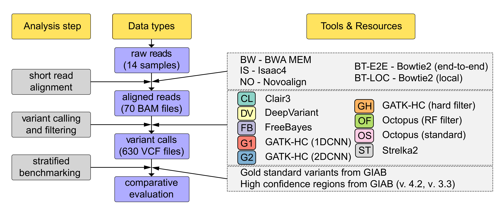

# Systematic comparison of modern variant callers
Companion repository for the human variant calling pipelines' benchmark. 

Repository contains the following analysis data and scripts:

`pipelines` folder contains all scripts used to run read aligners and variant callers

`eval_happy.sh` script was used to run the final benchmarking. `eval_happy_42.sh` is an analagous script used to evaluate the calls against the newer GIAB v.4.2 reference.

`gather_stats.sh` was used to gather per-sample `hap.py` stats into one file.

`benchmarking_analysis.R` script was used to run all statistical analyses described in the paper.

`concordance` folder contains scripts used in the analysis of variant call concordance between callers. RTGtools vcfeval was used for all GIAB samples to create a VCF file with TP, FP, and FN calls prior to all downstream analyses.

`CustomRegions` folder contains stratification BED files that were generated by the authors.

`master.bed` and `master_42.bed` files correspond to common regions in GIAB v. 3.3 and GIAB v. 4.2 reference releases.

**IMPORTANT!** Main files with the statistics generated by `hap.py` are available through Google Drive: 

Other data files in this repository correspond to hybrid selection metrics used to prepare Figure 1 and similar Supplementary figures, variant counts (used in Table 1 and Table 4), results of the concordance analysis (i.e., the final concordance matrix for all GIAB and non-GIAB samples),and coverage model data from Barbitoff et al., 2020.

Citation: Barbitoff Y.A., Abasov R., Tvorogova V.E., Glotov A.S., Predeus A.V. (2022) Systematic benchmark of state-of-the-art variant calling pipelines identifies major factors affecting accuracy of coding sequence variant discovery. *BMC Genomics*. 
