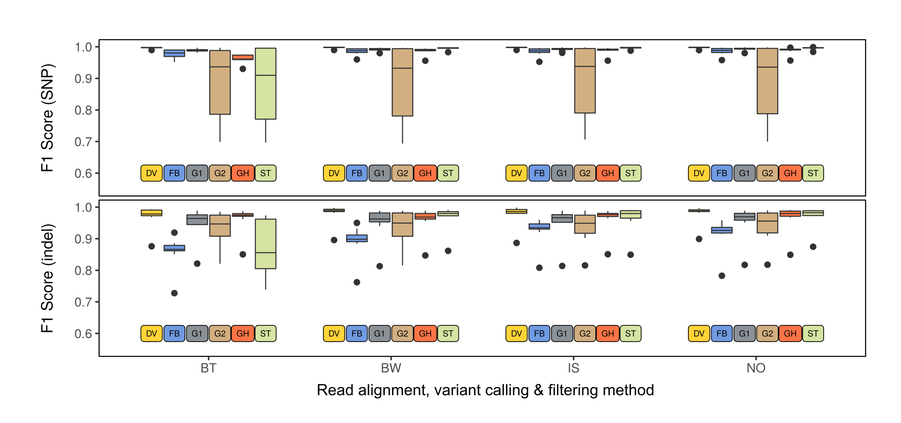

# Systematic comparison of modern variant callers
Companion repository for the human variant calling pipelines' benchmark. 

Repository contains the following analysis data and scripts:

`all_in_one.sh` script contains all commands that were used to run aligners, variant caller, and preliminary benchmarking.

`eval_happy.sh` script was used to run the final benchmarking.

`gather_stats.sh` was used to gather per-sample `hap.py` stats into one file.

`benchmarking_analysis.R` script was used to run all statistical analyses described in the paper.

`CustomRegions` folder contains stratification BED files that were generated by the authors.

Other data files in this repository correspond to the final statistics gathered from the `hap.py` output, hybrid selection metrics used to prepare Figure 1 and Figure S1, variant counts (used in Figure 1c and Table 1), and coverage model data from Barbitoff et al., 2020.

Citation: Abasov R., Tvorogova V.E., Glotov A.S., Predeus A.V., Barbitoff Y.A. (2021) Systematic evaluation of state-of-the-art variant calling pipelines identifies major factors affecting accuracy of coding sequence variant discovery. *bioRxiv*. 
